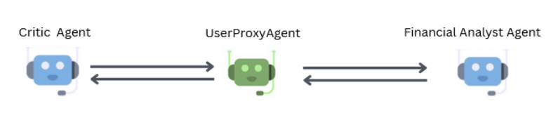
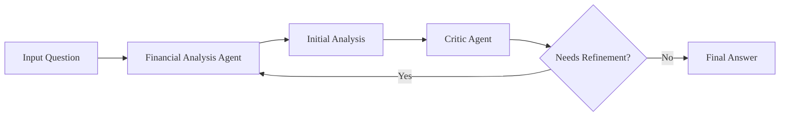
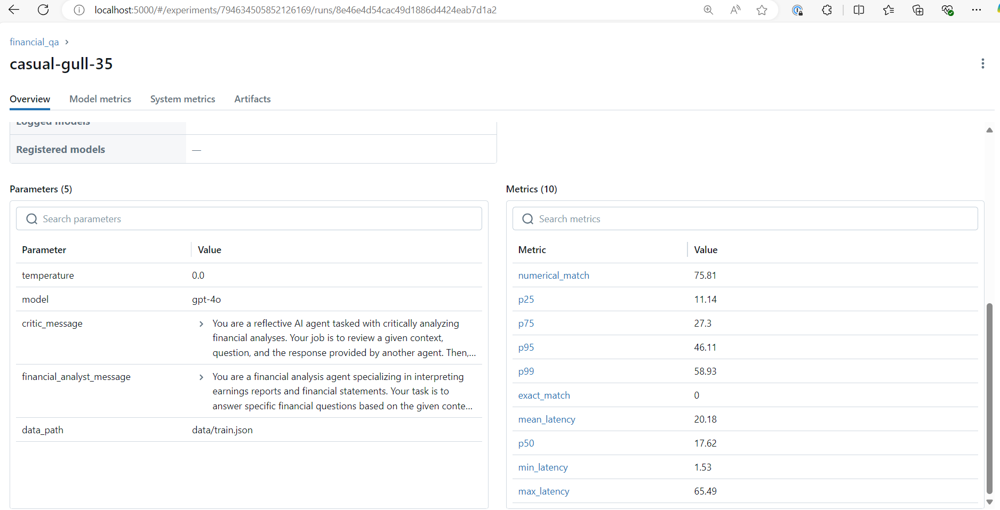

# Multi-Agent Financial QA System

The objective of this project is to develop a Language Model (LLM) driven prototype capable of answering questions based on text and table context. The prototype will be evaluated using the ConvFinQA dataset, specifically the train.json file.

## Solution Overview

This system leverages a dual-agent approach to perform accurate financial calculations and analysis through iterative refinement.

It consists of two specialized agents working in tandem:

### Financial Analysis Agent

- Interprets complex financial reports
- Extracts relevant numerical data
- Performs precise calculations
- Provides detailed step-by-step analysis

### Critic Agent

- Validates data extraction accuracy
- Verifies calculation steps
- Ensures logical consistency
- Confirms proper formatting and rounding

## Methodology

The system employs an iterative approach where calculations are continuously refined through agent collaboration until reaching optimal accuracy. This implementation is based on latest research in numerical reasoning as detailed in this [paper](https://arxiv.org/abs/2410.21741).



The solution was implemented using LangGraph, which provides a flexible framework for orchestrating agent interactions. MLflow was utilized to track experiment parameters, metrics, and model performance throughout the development process.

LLM: Azure OpenAI GPT 4o



The graph illustrates the iterative refinement process where the Financial Analysis Agent's output is validated by the Critic Agent. If refinement is needed, the process loops back for further analysis until the desired accuracy is achieved.

> [!NOTE]
> The table data in 2D list was converted to markdown table before supplying as a context to Agent.

## Set Up

### Running the CLI App

1. Set up environment and install dependencies

```bash
python -m venv .venv
.venv/Scripts/Activate.ps1 # Windows
source .venv/bin/activate # Linux / MacOS
pip install --upgrade pip
pip install -r requirements-dev.txt
```

> [!NOTE]
> The application was developed and tested using Python 3.10, hence Python >= 3.10 is recommended.

2. Set environment variables

```bash
AZURE_OPENAI_ENDPOINT=****
AZURE_OPENAI_API_KEY=****
OPENAI_API_VERSION=****
```

> [!NOTE]
> The application uses Azure OpenAI services for LLM

3. Start MLflow server locally

```bash
mlflow server
```

4. Test cli app

```bash
python cli.py --model "gpt-4o-mini" --temperature "0.0" --data-path "data/train.json" --n "100" --verbose

# cli options:
#   -h, --help                  show this help message and exit
#   --model MODEL               The name of the model to use.
#   --temperature TEMPERATURE   The temperature setting (must be between 0.0 and 1.0).
#   --data-path DATA_PATH       The path to the input data.
#   --n N                       Number of records to be processed.
#   --verbose                   Enable verbose mode.
```

5. Running the CLI app using Docker

Update the command parameters as required in `compose.yaml` and run the following command.

```bash
docker compose up --build
```

### Running tests

```
pytest -vv --junitxml=test-unit.xml --cov=. --cov-report=html
```

## Features

- CLI Application
- MLflow integration
- Multi-Agent Reflection
- LLM with retry
- Output parser with retry
- Containerized app
- Code quality checks
- Tests

## Evaluation Metrics

Two key metrics were chosen to evaluate the systems performance:

### 1. Exact Match (EM)

The Exact Match metric measures whether the systems output perfectly matches the ground truth answer, character for character.

**Pros**
- Standard metric in QA evaluation
- Easy to interpret - binary success/failure
- Ensures high precision requirements

**Cons**
- Very strict - small formatting differences cause failure
- Doesn't account for semantically correct but differently formatted answers
- May understate system performance

### 2. Numerical Match (NM)

A custom metric that extracts and compares numerical values between prediction and ground truth, allowing for small absolute differences (0.5 tolerance).

**Pros**
- More forgiving than EM for financial calculations
- Handles different number formats
- Accounts for acceptable rounding differences

**Cons**
- Does not take into account the units

Using both metrics provides a balanced evaluation approach - EM ensures strict accuracy where needed, while NM provides a more nuanced view of numerical reasoning capabilities.


## Results

> [!IMPORTANT]
> The results are based on the evaluation of first 100 records from `train.json`

The parameters, metrics, and output are all logged in MLFlow.



### Numerical Match

Since, we do not have units in the output generated by the model, we use numerical match metric to assess the accuracy of the model.

Numerical Match: 75.81%

> [!NOTE]
> The results are in `output.csv`

### Latency Analysis

The systems response time was thoroughly analyzed using various percentile metrics to understand performance characteristics:

- Mean latency: 20.18 seconds for the complete two-agent interaction
- Latency distribution:
    - P25: 11.14 seconds
    - P50 (median): 17.62 seconds
    - P75: 27.3 seconds
    - P95: 46.11 seconds
    - P99: 58.93 seconds
    - Range metrics:
    - Minimum latency: 1.53 seconds
    - Maximum latency: 65.49 seconds

These metrics indicate that while most queries are processed within a reasonable timeframe (median ~13 seconds), there can be occasional longer processing times for more complex calculations requiring multiple agent iterations.

The latency distribution shows a right-skewed pattern, with 75% of queries completing within 18.4 seconds, but some edge cases requiring up to 54.43 seconds for thorough analysis and verification.

## Findings

> [!IMPORTANT]
> The findings are based on the evaluation of first 100 records from `train.json`

### Sign Interpretation Errors

Incorrect handling of negative percentages or changes
Example: "what was the percentage change in benefits obligations from 2018 to 2019?"

Actual: 19.4%  
Predicted: -19.35%

Shows difficulty in correctly interpreting directional changes.

### Precision and Rounding Issues

Some predictions are close but not exactly matching the actual value
Example: "what portion of the authorized shares of class b common stock is outstanding?"

Actual: 56.6%  
Predicted: 0.565588

The question asks for portion, but the ground truth has percentage value.  
This highlights how correct numerical calculations may be penalized due to format mismatches between decimal and percentage representations.

Example: "if the 2003 growth rate is the same as 2002 , what would 2003 gas transmission throughput be in bcf?"

Actual: 645  
Predicted: 645.75

According to the tolerance setting, this is considered a mismatch. This highlights the precision issue between ground truth and prediction values—using standardized values in ground truth data would help provide clearer instructions to the model.

### Contextual Misinterpretation

Some errors suggest misunderstanding of the specific financial context
Example: "did 2015 adjusted ebitda increase more than 2015 actual ebitda?"

Predicted: 241.0 (which doesn't directly answer the yes/no question)

This is because the model is explicitly instructed to provide numerical answers based on the calculation steps.

### Content filter

1 out of 100 questions was filtered due to sensitive content in the question / context. Depending on the policy, an appropriate adjustment to the content filter may be required.

```
An unexpected BadRequestError occurred for request Single_ZBH/2002/page_46.pdf-3: Error code: 400 - {'error': {'message': "The response was filtered due to the prompt triggering Azure OpenAI's content management policy. Please modify your prompt and retry. To learn more about our content filtering policies please read our documentation: https://go.microsoft.com/fwlink/?linkid=2198766", 'type': None, 'param': 'prompt', 'code': 'content_filter', 'status': 400}}
```

## Shortcomings

### Latency

Being a two-agent system with reflection, there is some additional processing involved before arriving at the final answer. This increases the latency of the application, especially when the question is complex and requires deeper understanding of the context and multiple iterations.

### Accuracy

Being a financial QA application, it needs to have high accuracy. However, sometimes due to the ambiguous nature of questions and limitations in the prompt, it can lead to incorrect answers which could be costly. Instead of answering questions using provided free-form context, better accuracy could be achieved if the financial data were stored in a database, with an API provided as a tool to a ReAct agent.

### Evaluation Metrics

While the numerical match is a custom metric used to evaluate accuracy, additional metrics could be implemented to better assess the systems performance. The current evaluation approach might not capture all aspects of the systems accuracy and reliability in handling complex financial queries.